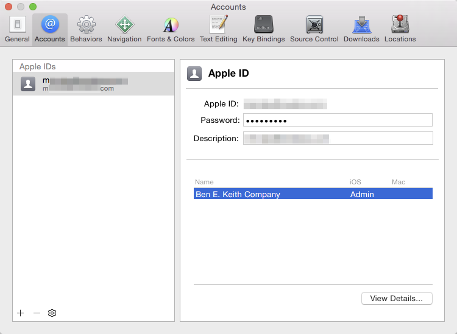
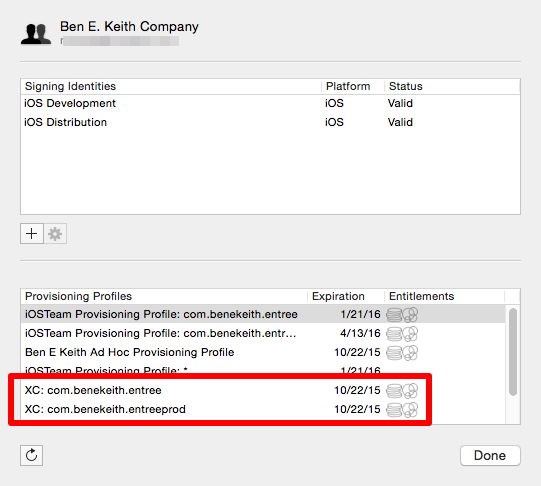

# Setup to deploy to TestFlight/iTunes Connect

[Apple Developer Login](https://idmsa.apple.com/IDMSWebAuth/login?&appIdKey=891bd3417a7776362562d2197f89480a8547b108fd934911bcbea0110d07f757&path=%2F%2Faccount%2Flogin.action)

[iTunes Connect](https://itunesconnect.apple.com)

## Adding the certificate

1. Login to the [Apple Developer account](https://idmsa.apple.com/IDMSWebAuth/login?&appIdKey=891bd3417a7776362562d2197f89480a8547b108fd934911bcbea0110d07f757&path=%2F%2Faccount%2Flogin.action)
2. Click Certificates
3. Click Production
4. Download the Ben E. Keith Company cert
5. Open it in Keychain Access

If it asks for a password, try bek12345

You should see the new iPhone Distribution: Ben E. Keith Company cert in your keychain

## Setup Xcode

1. Open Xcode and open the Preferences -> Accounts
2. Add your Apple ID

You should see Ben E. Keith on your profile

## Install provisioniing profiles

1. Login to the [Apple Developer account](https://idmsa.apple.com/IDMSWebAuth/login?&appIdKey=891bd3417a7776362562d2197f89480a8547b108fd934911bcbea0110d07f757&path=%2F%2Faccount%2Flogin.action)
2. Click Provisioning Profiles
3. Download the XC: com.benekeith.entreeprod and XC: com.benekeith.entree profiles
4. Click the profiles and they will automatically open in Xcode

Go to Xcode Preferences -> Accounts. Click your profile and click View Details... You should see your provisioning profiles.

## Enabling yourself as an Internal Tester

1. Login to [iTunes Connect](https://itunesconnect.apple.com)
2. Click Users and Roles
3. Click on your email
4. Flip the Internal Tester toggle on the right side
5. Go to My Apps and select the app you want to be an internal tester for
6. Click the Prerelease tab -> Internal Testers
7. Select your email address and click Invite

You should receive an email inviting you to download the app using TestFlight.