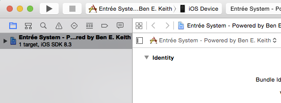
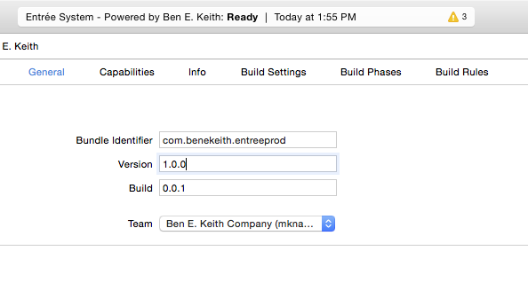
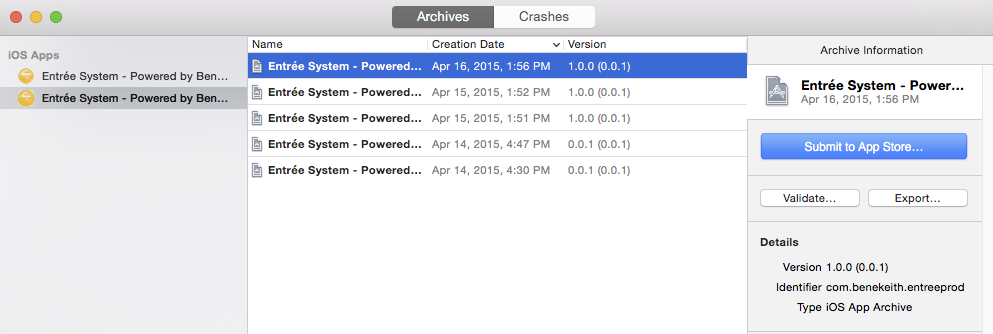
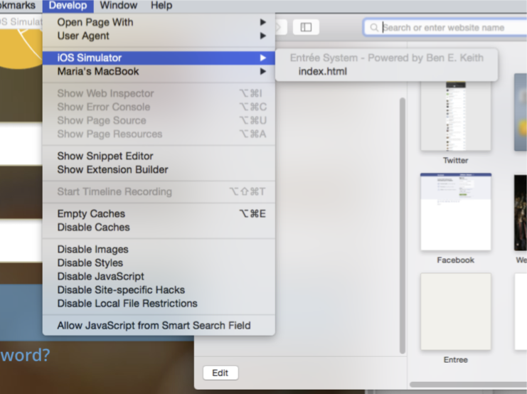

# 1. iTunes Connect app setup

There are 2 apps setup in [iTunes Connect](itunesconnect.apple.com).

 - Entrée System - Powered by Ben E. Keith
   - Points to QA when going through app store review process, otherwise points to Prod
   - Builds ending in **odd numbers point to the QA api** and **even numbers point to Prod**
   - Available on the app store and available to external testers (DSRs, pilot customers, etc.)
 - QA - Entrée System - Powered by Ben E. Keith
   - Points to QA api
   - Used only for testing

# 2. iOS build and deploy

These are the steps to regularly build and deploy the iOS app after your environment is setup.

## 2.1 Build

1. Follow the [Pre-build steps](3.1-Pre-build-steps.md)

**Testing and QA app**

1. Run ```grunt build:ios:test```
2. Run ```grunt phonegap:run:ios```
3. Make sure the app is working correctly through the emulator

**Prod App**

1. Run ```grunt build:ios:review``` Points to QA OR
   Run ```grunt build:ios:prod```
2. Run ```grunt phonegap:run:ios```
3. Make sure the app is working correctly through the emulator

**Troubleshooting**

> Warning: Unable to delete "build" file (ENOTEMPTY, directory not empty 'build/platforms/ios'). Use --force to continue.

Delete the build/platforms/ios/ directory and try running the command again	

## 2.2 Deploy to iTunes Connect

1. Follow the build steps for the app you want to deploy (QA or Prod)
2. Navigate to the ```build/platforms/ios/``` directory and open the ```.xcodeproj``` project in Xcode
3. In the upper-left, change the device to "iOS Device"



4. Select the project in the left panel to see the project details and make sure the following are set
 - Bundle Identifier: ```com.benekeith.entree``` for QA and ```com.benekeith.entreeprod``` for Prod
 - Version: should usually be the latest version for the app in [iTunes Connect](itunesconnect.apple.com) or the version for which TestFlight Beta Testing is enabled
 - Build: 
	 - QA: add 0.0.1 to the latest build number in iTunes Connect
	 - Prod: builds ending in **odd numbers point to the QA api** and **even numbers point to Prod**
 - Team: Select "Ben E. Keith Company"
 - Under Build Settings the Code Signing Identity should be Ben E. Keith Company



5. Go to the Product Menu -> Archive
6. Select the QA app and make sure the Identifier in the left panel says ```com.benekeith.entree``` for QA and ```com.benekeith.entreeprod``` for Prod
7. Click Validate..
8. Click Submit to App Store...
 - This will upload the build to iTunes Connect and you can view it under the "Prerelease" tab in the Processing section. Processing usually takes 5-10 minutes.

## 2.3 Submitting app for final review, submitting a new version

Once you have uploaded a build, it shows up in the Prerelease section of iTunes Connect.

When you are ready to submit a build for final review, you can go to the Build section under the Version tab in iTunes Connect 

The test accounts for Apple reviewers are as follows:

QA
apple_test_account@test.com
Apple2015

Production
apple_test_prod@test.com
Apple2015



## 2.3 Notifying Internal Testers

After the build is done processing, you can update internal testers that there is a new build to download.

1. Under the Prerelease tab click Internal Testers
2. Click the checkboxes next to the Internal Testers and click "Invite"

## 2.4 Releasing for External Testers

1. Upload a build
2. Provide beta info for testers 
	- What to Test
	- Feedback Email
	- Contact info
	- Demo account
	- App Description, Marketing URL (can be copied from the app info?)
3. Submit for Beta App Review. The app must go through a full app review and adhere to the App Store guidelines before External Users can test (~2 days)

## 2.5 Available Grunt tasks

**Build**

```grunt build:ios:test```

- Points to QA api
- Changes the logo to use the **green** logo
- Setup to deploy to QA app

```grunt build:ios:review```

- Points to QA api
- Changes the logo to use the **green** logo
- Setup to deploy to Prod app

```grunt build:ios:prod```

- Points to Prod api
- Changes the logo to use the **yellow** logo
- Setup to deploy to Prod app

**Run**

```grunt phonegap:run:ios```

- This runs the app in the emulator or on a connected device.
- You must run one of the build steps before the run command.

# Using iTunes Connect

Add Internal Testers

Notify Internal Testers

# Submitting to the App Store

# Debugging

1. Open Safari
2. Go to "Develop" menu
  - If you don't see the Develop menu...
    1. Click the Safari Menu
    2. Preferences
    3. Advanced tab
    4. Check "Show Develop menu in menu bar"
4. You should see your device or the iOS Simulator 
5. Select the app you want to debug (ex. index.html)

