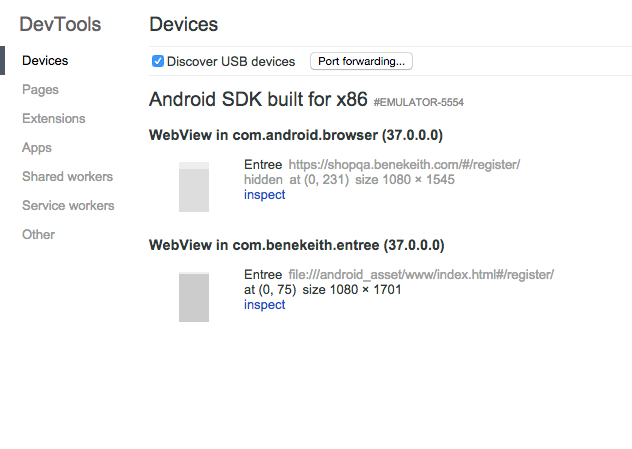

# Build

[Google Play Developer Console](https://play.google.com/apps/publish/)

1. Follow the [Pre-build steps]()

## For development

1. Run ```grunt build:android:review```
2. ```grunt phonegap:run:android:emulator```

The ```.apk``` is located in the ```build/platforms/android/ant-build/``` if needed.

## Build the apk

1. Run ```grunt build:android:review``` or ```grunt build:android:prod```
2. In Terminal, navigate to the cordova folder in the android build ```phonegap-app/BEKPhoneGap/build/platforms/android/cordova```
3. Run ```cordova build android --debug``` (or ```--release```). The apk file will be located at the following location at phonegap-app/BEKPhoneGap/build/platforms/android/ant-build/

## For deploying to the Google Play Store

Steps were taken from [this](http://stackoverflow.com/questions/26449512/how-to-create-singed-apk-file-using-cordova-command-line-interface) StackOverflow question

1. Set the next version number in the build file (ex. 1.0.2). Versions ending in odd numbers point to the QA api and odd numbers point to the Prod api.
2. Follow the steps under "Build the apk" and use the ```--release``` option for Step #3
3. Navigate up to the ```BEKPhoneGap/``` directory. You should see the myrelease.keystore there.
4. Sign the apk with the keystore. ```jarsigner -verbose -sigalg SHA1withRSA -digestalg SHA1 -keystore myrelease.keystore build/platforms/android/ant-build/CordovaApp-release-unsigned.apk benekeith-entree-prod```. The keystore pass word is **bek12345**
5. Navigate to ```build/platforms/android/ant-build``` directory
6. Rename the file with ```zipalign -v 4 CordovaApp-release-unsigned.apk BEKEntree.apk```
7. Now you can upload the BEKEntree.apk file to Google Play


## Available Grunt tasks

**Build**

```grunt build:android:review```

- Points to QA api
- Changes the logo to use the **green** logo
- Setup to deploy to Prod app

```grunt build:android:prod```

- Points to Prod api
- Changes the logo to use the **yellow** logo
- Setup to deploy to Prod app

**Run**

```grunt phonegap:run:android:emulator```

- This runs the app in the emulator or on a connected device.
- You must run one of the build steps before the run command.

# Debugging

1. Chrome dev tools in Android emulator
2. Tools -> More Tools -> Inspect Devices. You should see the emulator
3. Select “Inspect” for the WebView in com.benekeith.entree



If you don’t see your device. Try plugging in your phone or starting the emulator with the Chrome devices tab already open