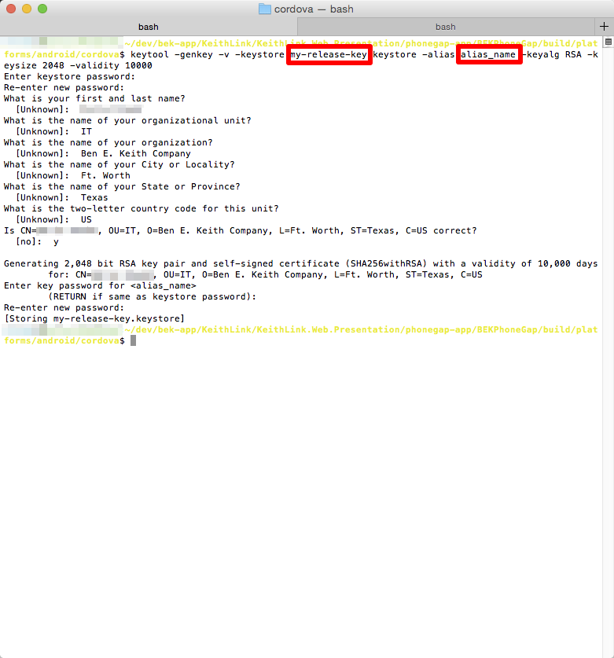

# Request access

1. Ask Phil to add you to the BEK Google Play Developer account and send him your gmail address

[Google Play Developer Console](https://play.google.com/apps/publish/)

# Build

1. Follow the [Pre-build steps]()

## For development

1. Run ```grunt build:android:review```
2. ```grunt phonegap:run:android:emulator```

The ```.apk``` is located in the ```build/platforms/android/ant-build/``` if needed.

## Build the apk

1. Run ```grunt build:android:review``` or ```grunt build:android:prod```
2. In Terminal, navigate to the cordova folder in the android build ```phonegap-app/BEKPhoneGap/build/platforms/android/cordova```
3. Run ```cordova build android --debug``` (or ```--release```). The apk file will be located at the following location at phonegap-app/BEKPhoneGap/build/platforms/android/ant-build/

## For deploying to the Google Play Store

Steps were taken from [this](http://stackoverflow.com/questions/26449512/how-to-create-singed-apk-file-using-cordova-command-line-interface) StackOverflow question

1. Follow the steps under Build the apk and use the ```--release``` option for Step #3
2. Navigate to the ```ant-build/``` directory
3. Generate a keystore using whatever keystore name and alias name you wish ```keytool -genkey -v -keystore <my-release-key>.keystore -alias <alias_name> -keyalg RSA -keysize 2048 -validity 10000```
4. You will be prompted to answer several questions and create a password. Use the password **bek12345** and the following answers from the screenshot.



5. You should see the new .keystore file in the cordova directory
6. Sign the apk ```jarsigner -verbose -sigalg SHA1withRSA -digestalg SHA1 -keystore my-release-key.keystore CordovaApp-release-unsigned.apk alias_name```. You will be prompted for the keystore passphrase
7. Rename the file ```zipalign -v 4 CordovaApp-release-unsigned.apk BEKEntree.apk```
8. Now you can upload the BEKEntree.apk file to Google Play


## Available Grunt tasks

**Build**

```grunt build:android:review```

- Points to QA api
- Changes the logo to use the **green** logo
- Setup to deploy to Prod app

```grunt build:android:prod```

- Points to Prod api
- Changes the logo to use the **yellow** logo
- Setup to deploy to Prod app

**Run**

```grunt phonegap:run:android:emulator```

- This runs the app in the emulator or on a connected device.
- You must run one of the build steps before the run command.

# Debugging

1. Chrome dev tools in Android emulator
2. Tools -> More Tools -> Inspect Devices. You should see the emulator
3. Select “Inspect” for the WebView in com.benekeith.entree


If you don’t see your device. Try plugging in your phone or starting the emulator with the Chrome devices tab already open